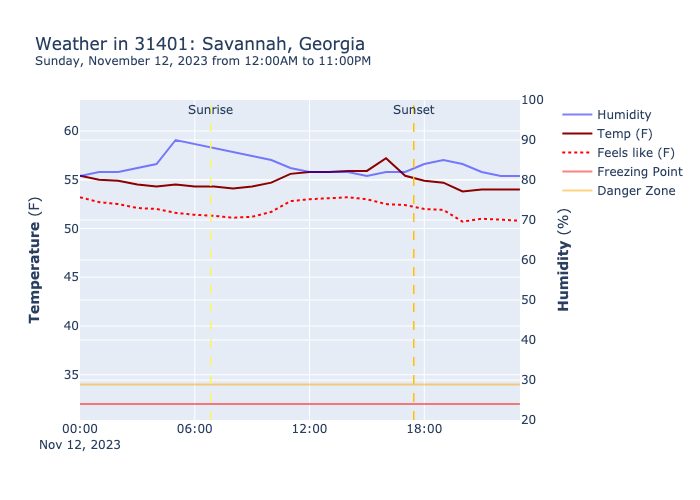

# Telegram Weather Watcher

Very simple program/script that:

- Grabs weather data for a given ZIP code
- Sums it up by temperature, wind, humidity, rain, with a special focus on whether it'll freeze
- Sends it to Telegram on a cron schedule

Useful for:

- Knowing when to take plants inside when it'll be freezing
- Knowing when to take stuff inside when it'll be super windy
- Adjusting watering schedules based on rain

I found there to be a surprising lack of free services for something like that, so here you go.

Always looks at the next 24hrs in a given ZIP code.

## Setup

You need an API key for a Telegram bot + a key for [weatherapi.com](https://weatherapi.com), both of which are free.

```bash
poetry shell
poetry install
```

## Run

```bash
❯ python3 weather_watcher/main.py --help
usage: main.py [-h] -c CHAT_ID -z ZIP_CODE -s CRON -o OUT_DIR [-f] [--no-telegram]

Grab weather, send to telegram

options:
  -h, --help            show this help message and exit
  -c CHAT_ID, --chat CHAT_ID
                        Chat ID
  -z ZIP_CODE, --zip ZIP_CODE
                        ZIP
  -s CRON, --cron CRON  Crontab schedule
  -o OUT_DIR, --out OUT_DIR
                        Out dir
  -f, --force           Send immediately
  --no-telegram         Skip telegram
```

## Docker

Recommended.

```bash
bash run.sh
```

Alternatively:

```bash
export DOCKER_DEFAULT_PLATFORM=linux/amd64
docker compose build
docker tag weather-alerts:latest your.repo.url/weather-alerts
docker push your.repo.url/weather-alerts
```

## Test

```bash
pytest weather_watcher/test
```

## Example output

### Chart




### Telegram message

```
🌡️ Weather Report for 31401: Savannah, Georgia 🌡️
Generated at: Sun, Nov 12 2023 @ 04:14PM
From: 12:00AM to 11:00PM

🌅 Sunrise: 06:50AM
🌇 Sunset: 05:27PM

## Temperatures
⬇️ Lowest temp: 53.8F at 2023-11-12 20:00:00
⬆️ Highest temp: 57.2F at 2023-11-12 16:00:00
🦆 Average humidity: 83.7%

## Rainfall
🌵 No rain in the next 24 hours

## Wind
🌬️ Average wind: 7.3mph
🌬️ Max wind: 10.5mph at 2023-11-12 16:00:00

## Frost
✅ No freezing temps in the next 24 hours
```
